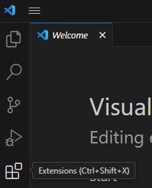
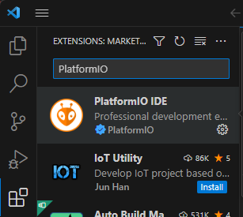
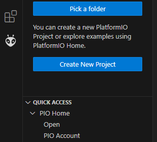
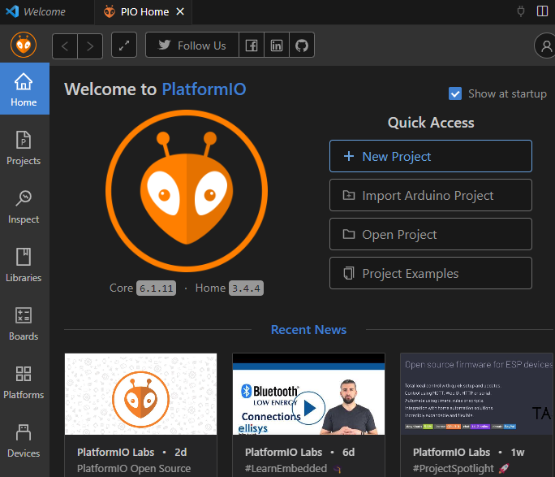
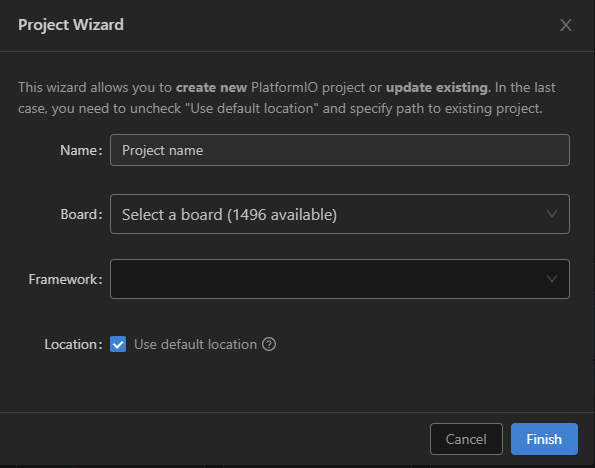
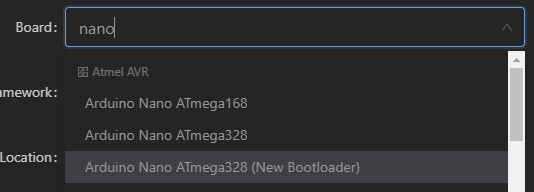
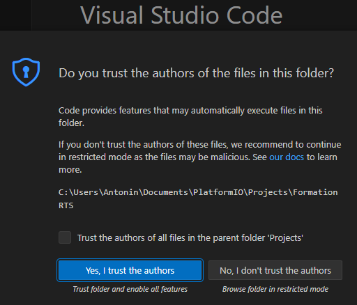
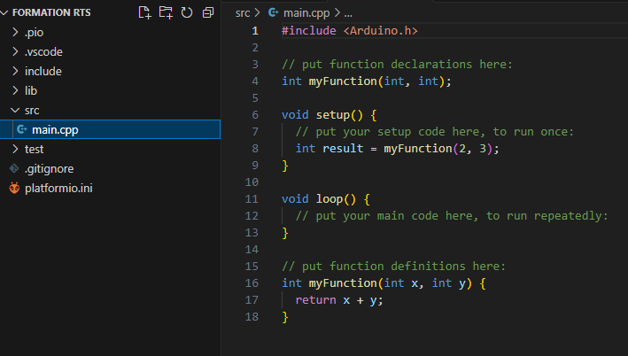

# Formation_PlatformIO
Formation Platform IO de RTS 2023

## I. Installation de VSCode et PlatformIO

### - Windows:

1. Télécharger et installer VSCode à partir du site: https://code.visualstudio.com/

2. (Optionnel) Installer git bash for windows

    2.1 Téléchargez git-scm sur https://git-scm.com/downloads 

    2.2 Installez le en sélectionnant les paramètres recommandés 
    
    :warning: Pensez à changer le style de terminal par "nano" au lieu de "vim" par défault (si vous savez utiliser vim vous n'avez de toute façon pas besoin de ce tuto)

### - Linux:

1. Télécharger le package ".deb" VSCode à partir du site: https://code.visualstudio.com/ 

2. Ouvrez un terminal dans le répertoire où se trouve le package. Installez le package avec la commande suivante:

```bash

sudo apt install ./"nom_du_ficher".deb

```
### PlatformIO

1. Ouvrez l'interface puis naviguer vers "Extensions" (Ctrl+shift+X)

    

2. Dans la barre de recherche tapez "PlatformIO", puis appuyez sur "install"

    

3. Laissez l'installation se faire une fois terminée, un alien apparaitra sur la barre verticale de gauche.

## II. Premier projet avec PlatformIO

1. Appuez sur l'alien présent sur la barre latérale puis cliquez sur "create new project"

    

2. Un nouvel onglet s'ouvre sur VSCode, c'est l'onglet HOME de PlatformIO. C'est ici que l'on configure l'extension et lance de nouveaux projets. cliquez sur "New project" en dessous "Quick Access"

    

3. Une nouvelle fenêtre s'ouvre "Project wizard". Commencez par choisir un nom pour votre projet (Parfois c'est l'étape la plus dure)

    

4. Ensuite sélectionnez une carte, dans la cadre de la formation Arduino RTS vous devez choisir "Arduino Nano ATmega328" Il arrive que le chargement des boards soit un peu long. Soyez patient.

    

5. Pour un Arduino la question du Framework ne se pose généralement pas. On utilise le framework Arduino par défaut. 

6. Vous pouvez laissez l'emplacement par défaut pour le projet, puis appuyez sur "Finish". La création de projet peut être un peu longue, surtout la première fois. C'est tout à fait normal, laissez PlatformIO faire.

7. Une fenêtre vous demandans si vous souhaitez faire confiance aux auteurs des fichiers dans le répertoire va apparaitre. Sélectionnez "Oui"

    

8. De nombreux répertoires et fichiers se sont créés dans votre projet. Pas de panique voici leurs roles:

    -  **.pio** C'est le répertoire de travail de PlatformIO. Vous n'aurez pas à vous y rendre, pour l'instant oubliez le.

    - **.vscode** De même, ne modifiez pas son contenu.

    - **include** C'est ici qu'iront les fichiers header de vos fichiers sources. Le fichier "README" détaille son utilisation mais les cours de C de première année sont maitrisés non ?

    - **lib** Les librairies que vous allez ajouter avec PlatformIO seront présentes ici. Il peut être intéressant de s'y rendre pour lire les exemples d'utilisation et les headers des fonctions. Dans un premier temps ne modifiez pas manuellement son contenu.

    - **src** Le répertoire principal, c'est ici que tous vos fichiers sources se trouveront. Pour l'instant il n'existe que le fichier main.cpp. Plus de ".ino" comme avec l'IDE Arduino. Ce sont des .cpp pour C++. Attention toutes les fonctionnalitées du C++ ne sont pas présentes. Oubliez "#include <iostream>" de toute façon où sont l'écran et le clavier ?

    - **test** Ce répertoire sert à faire des tests de fonctionnalitées et nous ne l'utiliseront pas dans les formations.

    - **.gitignore** Le fichier qui permet à git de savoir quels fichiers surveiller et quels fichiers ignorer. Une formation git viendra dans les prochaines semaines.

    - **platformio.ini** Le fichier de configuration de PlatformIO, spécifique au projet. Il est très utile et nous le modifierons dans le cadre des formations. Il permet notamment de modifier la vitesse de transmission du port série.

    

## Vous voilà prêt à débuter la formation !